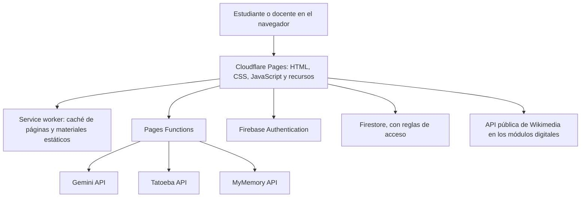

# Arquitectura

## Componentes

### Sitio estático

`wrangler.jsonc` publica `outputs/`. Allí están el portal, las páginas institucionales, los juegos, los recursos y el service worker. Las páginas Villa Esther están agrupadas en `outputs/instituciones/villa-esther/`; sus estilos, scripts e imágenes propios están en carpetas `villa-esther` bajo `css/`, `js/` y `assets/`. Vicente Díaz tiene sus recursos de identidad en carpetas `vicente-diaz`.

### Funciones de Cloudflare

- `functions/api/aula.js` expone `POST /api/aula`. Comprueba la sesión de Firebase y utiliza el secreto `GEMINI_API_KEY` para solicitar contenido a Gemini.
- `functions/api/phrases.js` expone `GET /api/phrases` y consulta frases de Tatoeba.
- `functions/api/translate.js` expone `GET /api/translate` y consulta MyMemory para traducir de español a inglés y viceversa.

Las claves de proveedor no pertenecen al JavaScript servido al navegador. La clave de Gemini se lee como variable secreta en Cloudflare.

### Firebase

El navegador usa Firebase Authentication y Firestore en el aula digital. Las reglas están en `firestore.rules`; las funciones administrativas y callable están en `firebase-functions/`. Los roles docentes se asignan desde una herramienta de administración, no desde el formulario público.

### Funcionamiento sin conexión

El service worker almacena páginas y recursos estáticos seleccionados. El contenido ya descargado puede abrirse sin conexión. Inicio de sesión, sincronización, Gemini, Tatoeba y MyMemory necesitan internet. El servidor estático local no ejecuta Pages Functions.

## Decisiones de diseño

- Sitio sin un paso de compilación para simplificar el despliegue y poder inspeccionar cada HTML.
- Recursos institucionales aislados por carpeta para facilitar mantenimiento y branding.
- Pages Functions como capa intermediaria para APIs que requieren secretos o manejo del servidor.
- Contenido generado por IA y traducciones automáticas tratados como material de apoyo que requiere revisión.
